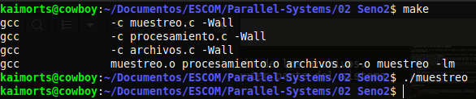
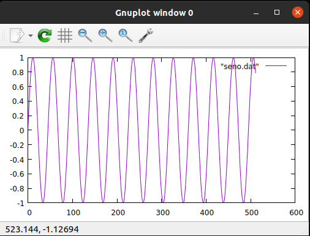
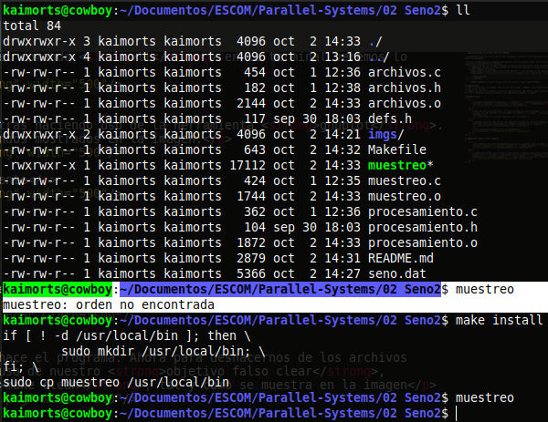
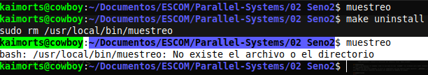

#  Aplicación para la función Seno con módulos

* La diferencia yace en que el código está en módulos, es decir, está contenido en distintos archivos para un mejor mantenimiento.

* En este ejemplo práctico generamos 512 muestras para la función `seno` con el fin de de poner visualizarlo utilizando la herramienta de `gnuplot`.
* Para poder ejecutar el siguiente programa lo que se debe de hacer es crear un archivo makefile:
	- `makefile`: Alberga las instrucciones de compilación para que no tengas que escribirlas cada vez que quieres compilar un archivo.
	- `make clean`: Elimina todos los archivos objetos (\*.o) generados en la compilación de los archivos.
	- `make install`: Establece el archivo en una ruta general para ejecutarlo en cualquier parte del sistema
		```
		> make install
		> muestreo
		```
	- `make uninsatll`: Dehace la ejecución del objetivo falso `make install`.

## Explicación
* `-lm` : Al utilizar el comando `-lm` lo que hace es que _linkear_ los archivos para poder trabajar con ello y que no marque errores.
* `-Wall`: Al usar este comando, le dice al compilador que nos muestre todos aquellos __warnings__. Esto es útil para visualizar aquellas variables y/o espacios de memoria no usados

## Demostración
<ol>
	<li>
		<p>Primero realizamos el comando <strong>make</strong> para generar los archivos objetos con el fin de ejecutar el programa y posteriormente lo ejecutamos: <strong>./muestreo</strong> </p> 
		
	</li>
	<li>
		<p>Una vez que se ha ejecutado, se habrá generado un archivo llamado <strong>seno.dat</strong>, el cual contiene las 512 muestras. Si ejecutamos el comando <strong>ll</strong> en la terminal veremos lo siguiente: </p>
		
	</li>
	<li>
		<p>Podemos graficar cada una de esas muestras haciendo uso de la herramienta <strong>gnuplot</strong>. Para poder hacer eso, ejecutamos los comandos mostrados en la imagen:</p>
		
		<br>
		<p>Y la gráfica resultante sería la siguiente</p>
		
	</li>
</ol>

## Objetivos falsos (False targets)
<ol>
	<li>
		<p>Si queremos que nuestro programa se ejecute en cualquier lugar de nuestro sistema y sin necesidad de especificar que es un ejecutable, o sea, sin usar: <strong>./muestreo</strong>, lo que debemos de realizar es ejecutar el siguiente comando: <strong>make install</strong>. </p>
		
	</li>
	<li>
		<p>Si ahora queremos dehacer esta acción, simplemente debemos de ejecutar el comando <strong>make uninstall</strong>, tal y como se muestra.</p>
		
	</li>
	<li>
		<p>Hasta este punto, esto es todo lo que hace el programa. Ahora para deshacernos de los archivos objetos (<strong>(*.o)</strong>) hacemos uso de nuestro <strong>objetivo falso clear</strong>, ejecutando el  siguiente comando: <strong>make clean</strong>, tal y como se muestra en la imagen</p>
		
	</li>
</ol>

<p>Y ya compa.</p>