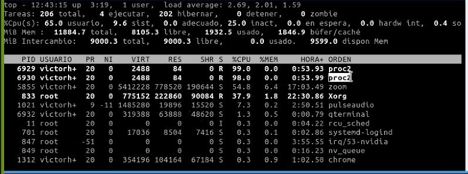

# Hilos

Los **hilos** son objetos dinámicos, cada uno de los cuáles ejecuta una secuencia de instrucciones y que **comparten entre sí los recursos de un proceso**. Algunas de sus características son:
 - Comparte los recursos del proceso padre
 - Las variables declaradas la pueden usar todos los hilos, por lo que **tiene memoria compartida**, pero puede haber _**problemas de condiciones de carrera**_.

## Concurrencia vs Paralelismo
### Concurrencia
- Es **el número máximo de hilos que podría estar ejecutando simultáneamente** si dispusiera de un **número ilimitado de procesadores** y depende de la aplicación.

### Paralelismo
- Es **el número real de hilos que se están ejecutando simultáneamente en un momento determinado** y por lo tanto **está limitado por el número de procesadores** y por la carga actual del sistema.

	

### Ejemplo de Paralelismo vs Concurrencia
- Si generamos dos procesos, se vería de la siguiente forma:

	
	
	Dado que tengo 4 núcleos, cada uno de los procesos se le asigna 100%. **Aquí hay Paralelismo**.

- Si generamos 8 procesos podemos ver un poco mejor el comportamiento y diferencias entre Paralelismo y Concurrencia.

	
	
	Considerando que tenemos 4 núcleos y 8 procesos, se le asigna 50% a cada proceso. Esto se puede ver de la siguiente forma:
		
|      |    |     |
|------|----|-----|
|Core 1| P1 | 50% |
| 100% | P2 | 50% |
|Core 2| P3 | 50% |
| 100% | P4 | 50% |
|Core 3| P5 | 50% |
| 100% | P6 | 50% |
|Core 4| P7 | 50% |
| 100% | P8 | 50% |

> 1 core está atendiendo a 2 procesos: Divide su 100% en 2 y los atiende por pedazos de tiempo.

Aquí ocurre Concurrencia:
- Un core tiene que atender a varios procesos y su tiempo de CPU lo divide.
- Concurrencia. Cuántos procesos llega a manejar un solo núcleo 

> Ejecución entre `cores` es __en forma paralela__, pero la ejecución entre procesos de un determinado core es __en concurrencia__.

## Hilos de Linux
> Para el `kernel` de Linux, no hay concepto de hilo. Linux implementa todos los hilos como procesos estándar.

El `kernel` de Linux no proporciona ninguna semántica de planificación especial o estructuras de datos para representar hilos.

> Un **hilo** es simplemente **un proceso que comparte ciertos recursos con otros proceso**.

### Creación de Hilos
 - Cada hilo tiene una **`task_struct`** única y aparece en el kernel como un proceso normal.
 - Los hilos se crean igual que las tareas normales, con la excepción de que en la llamada al sistema `clone()` se pasan banderas correspondientes a los recursos específicos que se van a compartir.

	```c
	clone(CLONE_VM | CLONE_FS | CLONE_FILES | CLONE_SIGHAND, 0); 
	```
- Para una llamada al sistema `fork()` se tiene: 
	```c
		clone(SIGCHLD, 0);
	```
- `pthread_create`: Función para crear los hilos en espacio de usuario:
	```c
	#include <pthread.h>
	int pthread_create(
		pthread_t *thread, 
		const pthread_attr_t *attr,
		void *(*start_routine)(void *),
		void *arg);
	```
- `pthread_t`: Ayuda a conocer el **identificador del hilo**. Es análogo al `pid_t`.
- `pthread_join`: Espera a que se termine el hilo que se está ejecutando. Es el análogo al **wait**.
	```c
	int pthread_join(pthread_t thread, void **retval);
	``` 
- `**retval`: Sirve para **tener el status del hilo**.
- `pthread_exit`: Esta función termina la llamada al código del hilo y se retorna un valor en `retval`. Es la función equivalente al `exit` en procesos.

> **Nota**: En el archivo `Makefile` de cada programa debemos agregar la bandera para compilación de hilos: `-lpthread`.
