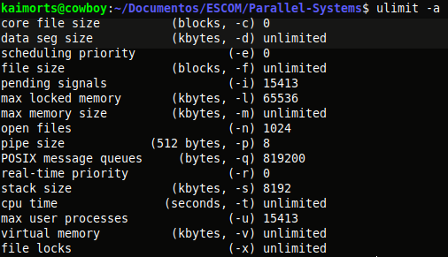

# IPC

- Los procesos se pueden ejecutar en una misma computadora (__nivel local__), como:
	- Tuberías sin nombre (Pipes).
	- Tuberías con nombre (FIFOS).
	- Semáforos.
	- Memoria compartida.
	- Colas de mensajes.

- Los procesos se pueden ejecutar en computadoras diferentes (__nivel remoto__), como:
	- Sockets TCP
	- Sockets UDP

Veremos el mecanismo de tuberías (Pipes).

## Pipes
- Esta tubería se crean con la llamada a la función `pipe`. S

```c
#include <unistd.h>
int pipe(int pipefd[2]);
```
- Necesitas dos descriptores:
	- Uno para escritura y otra para lectura
- Si la tubería es creada con éxito la función pipe retorna cero, en caso de error el retorno es -1.

- Crea un canal de datos unidireccional para crear dos procesos, y __sólo el procesos que hace la llamada y sus descendientes hacen la llamada__.

- Los dos elementos de pipefd son dos descriptores de archivos


- En el programa v2, los hijos acceden al pipe de escritura y el padre, va al descriptor de archivo de lectura.
Para poder hacer esto utilizamos las llamadas al sistema `read()` y `write()`, con el fin de hacer comunicacón de procesos
- El tamaño máximo que se puede enviar es de 4kb. Podemos checarlo con el comando `ulimit -a` 



- Si se necesita mandar bloques de memoria mas grande se debe utilizar otro, como memoria compartida.

Usamos pipes cuando queremos retonrar muchos valores, como por ejemplo, un arreglo. 
> Si queremos ordenar un arreglo, lo que haríamos sería usar pipes, no nos serviría exit() y wait().