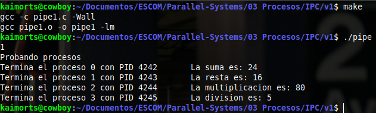
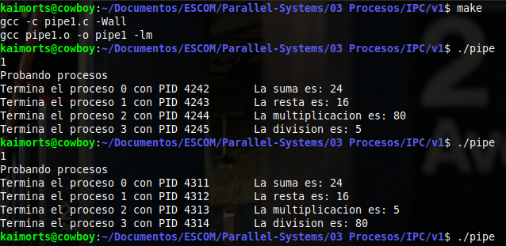
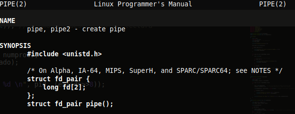

# Utilizando tuberías (pipes) v1: Operaciones aritméticas

## Descripción.
Este programa crea una __tubería compartida__, creando cuatro procesos. Cada uno de estos procesos realiza una operación aritmética básica. Dichas operaciones aritméticas son:

- Suma
- Resta
- Multiplicación
- División

En lugar de usar `exit()` y `wait()` para mandar los resultados de los procesos hijos, usaremos tuberías (y su archivo descriptor) para ver los resultados generados de los procesos hijos.

### Ejecución del programa
> make
> ./pipe1



Sin embargo, cuando lo ejecutamos varias veces puede llegar a verse algo distinto, como lo siguiente:



El detalle ocurre ya porque estamos usando una sola tuberia, por ser una __tubería compartida__. Es decir, los 4 procesos hijos están escribiendo sobre la misma tubería pero ¿en qué forma? Se hace en la forma en que el planificador los haya asignado.

> El problema se resuleve haciendo una tuberia por cada operación (el nuevo programa está en v2/pip2.c)

## Desarrollo
En un principio se toma como plantilla el archivo contenido en `03 Procesos/v2/proc2.c`, el cuál se le harán modificaciones.

### Archivo descriptor (File descriptor)
Primero, en la función principal (`main()`) se declarará un arreglo de dos elementos que representará __el archivo descriptor__, al cuál le llamaremos `pipefd`.
- `pipefd[0]`: Es el descriptor de escritura de la tubería.
- `pipefd[1]`: Es el descriptor de lectura de la tubería.


### Creando la tubería (pipe)
Para poder crear una tubería hacemos uso de llamada al sistema `pipe()`. Si queremos más información acerca de ésta, basta con ejecutar en una terminal el comando: `man pipe`.



- Al ejecutar la llamada al sistema nos devuelve un valor entero el cuál representa __el estado de la tubería__.
	- `edo_pipe = 0`: Específica la correcta creación de la tubería.
	- `edo_pipe = -1`: Específica un __error__ en la creación de la tubería.

### Proceso hijo
Para poder trabajar con el proceso hijo debemos de tener el control del mismo a partir de un índice. Este índice nos permitirá saber qué operación le corresponde y para que el proceso padre pueda ubicarlo. Es por ello que le pasamos como parámetro el __número de proceso__ (`np`). Además, necesitamos el __archivo descriptor__ (`pipefd`) para las operaciones a realizar.

- Dentro del proceso hijo, vamos a declarar los dos valores a los que les aplicaremos las operaciones aritméticas.
Dado que __el proceso hijo utilizará el descriptor de escritura__, debemos de cerrar el descriptor de lectura. Para ello hacemos uso de la llamada al sistema `close()`.

- A continuación debemos de comprobar el valor del número de proceso y asignar una tarea distinta a cada uno de ellos. Para esto hacemos uso de sentencias `if` que comprobarán el __número del proceso__.

- En cada uno de los bloques (dependiendo del número de proceso), realizaremos su operación correspondiente. Enfoquémonos en el número de proceso 0, cuya tarea es la suma. 

```c 
void proceso_hijo(int np, int pipefd[]){
	int num1 = 72, num2 = 9;

	close(pipefd[0]);
	
	if (np == 0)
	{
		suma = num1 + num2;
		
		// pipfd[1]: Descriptor de escritura de la tuberia
		write(pipefd[1], &suma, sizeof(int));
	}
	...
	...
}
```
> Utilizaremos la tubería para mandar el resultado de la operación según corresponda al número de proceso. Para ello será necesario usar la función `write()`.

- Como anteriormente se mencionó, `pipefd[1]` hace referencia al __descriptor de escritura__, el cuál será utilizado para mandar la información en la tubería en conjunto con la llamada al sistema `write()`, de la siguiente forma:

```c
		...
		write(pipefd[1], &suma, sizeof(int));
	  //write(descriptor, bola de datos, cantidad de bola de datos)
```

- Una vez que se ha utilizado el descriptor de escritura, al igual que el descriptor de lectura, debemos de cerrarlo. Para ello haremos nuevamente uso de la llamada al sistema `close()` pero cuyo parámetro, en este caso, será `pipefd[1]`, el cuál representa el descriptor de escritura.

- Finalmente, debemos de tener un control para saber qué proceso y qué operacion relacionada se ejecutaron. Para mandar esta información hacemos uso de la llamada al sistema `exit()`, cuyo argumento será el número de proceso.

El código de esta función es el siguiente:

```c
void proceso_hijo(int np, int pipefd[]) {
	
	int num1 = 72, num2 = 9;
	int suma, resta, multi, divi;

	close(pipefd[0]);

	if (np == 0) {
		suma = num1 + num2;
		// descriptor de escritura de la tuberia
		write(pipefd[1], &suma, sizeof(int));
	}
	else if (np == 1) {
		resta = num1 - num2;
		write(pipefd[1], &resta, sizeof(int));
	}
	else if (np == 2) {
		multi = num1 * num2;
		write(pipefd[1], &multi, sizeof(int));
	}
	else if (np == 3) {
		divi = num1 / num2;
		write(pipefd[1], &divi, sizeof(int));
	}

	// Cerramos el descriptor de escritura para el proceso hijo
	close(pipefd[1]); 

	// Regresamos el número de proceso para saber quien termina
	exit(np);
}
``` 

### Proceso padre
La operación del proceso padre es saber qué hijo se ejecutó y qué operación realizó. Por tanto, el archivo descriptor que utilizará será el de __lectura__. Por esta razón, uno de sus parámetros es el arreglo que contiene el _file description_ (`pipefd`).

- Iteraremos sobre cada uno de los procesos.
- Debemos de tener una forma de comprobar o verificar si un proceso ya ha finalizado. Para hacer esto hacemos uso de la llamada al sistema `wait()` y le pasaremos como parámetro el estado.
	- En este caso, la variable `estado` nos devolverá el valor de retorno de la llamada al sistema `exit()` contenida en la funcíón de `proceso_hijo()` antes implementada.
	- Recordemos que `exit()` NO NOS DEVUELVE EL VALOR DE LA OPERACIÓN ARITMÉTICA, sino que __nos devuelve el número de proceso__ asociado.

- Una vez que tenemos el número del proceso, lo que debemos de hacer es __recuperar el valor de la operación que se ejecutó__. Para ello se hace uso de la llamada al sistema `read()`, cuyos parámetros son muy similares a los de `write()`. La diferencia relevante es que __utilizamos el descriptor de lectura__, el cuál está contenido en `pipefd[0]`. 

- Cuando leemos el resultado de la operación realizada, dependiendo del número de proceso, debemos de tener un lugar en donde almacenarlo, para ello utilizamos la variable `resultado`.

- Finalmente, dado que ya tenemos conocimiento de cuál número de proceso ejecuta qué operación, hacemos una comparasión para imprimir la información correspondiente. Y repetimos esto para cada número de proceso (relacionado con cada operación).

```c
void proceso_padre(int pipefd[]) {
	register int np;
	pid_t pid;
	int estado, numproc, resultado;

	for (np = 0; np < NUM_PROC; np++) {
		
		pid = wait(&estado);  	// Aqui nos dice que ya acabo el proceso hijo
		numproc = estado >> 8;	// El estado regresara el número del proceso

		read(pipefd[0], &resultado, sizeof(int)); // Usamos el descriptor de lectura

		if (numproc == 0) {
			printf("Termina el proceso %d\t", numproc);
			printf("La suma es: %d\n", resultado);
		}
		...
	}
}
```


