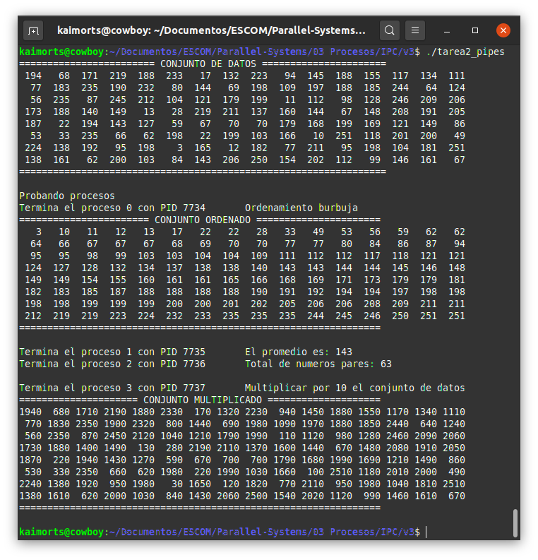

# Tuberías dedicadas (pipes) [Tarea]
Hacer un programa que __genere 4 procesos hijos__ y __un conjunto de 128 valores enteros__. Considere lo siguiente:

## Descripción
a) __Usar un a tubería (pipe) por cada uno de los procesos hijos__. Cada proceso hijo ejecutará un algoritmo de los siguientes.

1. Realizar el __ordenamiento de los valores enteros__. Usar el algoritmo burbuja programado por el alumno (a). Utilizar el mismo arreglo para regresar el ordenamiento. NO usar arreglos auxiliares.
2. Calcular el promedio del conjunto de valores. Mostrar el valor entero del promedio.
3. Obtener cuántos números pares existen en el conjunto de datos.
4. Multiplicar el conjunto de valores enteros por una constante (c = 10). Utilizar el mismo arreglo para regresar el producto. 

> No usar arreglos auxiliares.

## Estructura del código
b) El proceso padre debe recibir los reusltados de cada proceso hijo e imprimirlos.

En un principio se utiliza la misma estructura que el archivo contenido en `v2/proc2.c`. Sin embargo, el proyecto debe de crear módulos para cada una las tareas. El proyecto tiene la siguiente estructura:
- `principal.c`: Este archivo debe de tener a la función `main`.
- `procesos.c`: Este archivo debe tener las funciones del proceso hijo y el proceso padre.
- `procesamiento.c`: Este archivo debe de tener las funciones de los algoritmos.
- `helper.c`: Este archivo debe de tener las funciones de: `reservarMemoria`, `llenarArreglo` e `imprimirArreglo`.
- Definir los archivos `.h` correspondientes: `procesos.h`, `procesamiento.h`, `helper.h` y `defs.h` (contiene N y NUM_PROC).
- Archivo Makefile completo

## Diagrama de estructura del código


## Explicación

* __`función main()`__: Contiene la lógica de ejecución del programa principal utilizando tuberías dedicadas para cada uno de los procesos. Para ello se hace uso de __un descriptor de archivo__ (_file descriptor_), el cuál es decalarado como __un arreglo de descriptores por cada proceso__.

* __`función proceso_padre()`__: Asigna tiempo de CPU a cada uno de los procesos hijos para obtener el resultado de su operacion asignada. Una vez hecho esto, utiliza el _descriptor de lectura_ para obtener los resultados  y/o modificaciones hechas por las operaciones asociadas.


* __`función proceso_hijo(np, datos)`__: Verifica el número de proceso que se va a ejecutar y con base en ello, realiza su operación correspondiente. Dependiendo del número de proceso (**`np`**) que sea, llama a la función para encontrar el __mayor o menor número__ en el arreglo **`datos`**.
	* `np = 0`: Llama y ejecuta la función __`bubbleSort(datos)`__.
	* `np = 1`: Llama y ejecuta la función __`calcularPromedio(datos)`__.
	* `np = 2`: Llama y ejecuta la función __`cuantosPares(datos)`__.
	* `np = 3`: Llama y ejecuta la función __`multiplicarArreglo(datos)`__.

	> En cada uno de los procesos, dado que vamos a escribir sobre la tubería, cerramos el descriptor de lectura y usamos el descriptor de escritura para mandar el resultado de la operación. 

* __`función reservarMemoria()`__: Reserva memoria para el arreglo de enteros llamado _`datos`_.
* __`función llenarArreglo(datos)`__: Genera números entre 0 y 256 para los almacenarlos en el arreglo antes creado __`datos`__.
* __`función imprimirArreglo(datos)`__: Imprime los valores del arreglo __`datos`__ por filas (cada 16 elementos).

* __`función bubbleSort(datos)`__: Realiza el ordenamiento por burbuja sin utilizar memoria extra.
* __`función calcularPromedio(datos)`__: Calcula el promedio del arreglo __`datos`__. 
* __`función cuantosPares(datos)`__: Cuenta cuántos números pares están en el arreglo __`datos`__.
* __`función multiplicarArreglo(datos)`__: Considera una constante `C` y multiplicada cada elemento del conjunto de datos por ésta.


> Cabe destacar que cada una de las operaciones realizadas __trabajan con una copia del arreglo original__ y respetan el tiempo de cpu de cada proceso. Por lo que no hay problemas a la hora de usar una misma variable.

### Ejecutar programa
Para poder ejecutar este programa es suficiente con ejecutar el comando __`make`__ en una terminal en la ruta donde tienes guardado el archivo __`principal.c`__.

```bash
user@computer:~/path $ make
gcc -c procesamiento.c -Wall
gcc -c helper.c -Wall
gcc -c principal.c -Wall
gcc -c procesos.c -Wall
gcc procesamiento.o helper.o principal.o procesos.o -o tarea2_pipes -lm
```

Y posteriormente basta con ejecutar: `./tarea2_pipes`. Al hacer esto, tenemos la siguiente salida.

