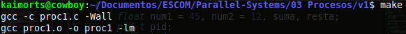
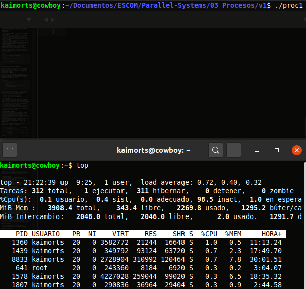
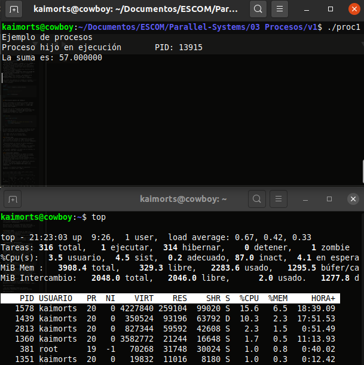
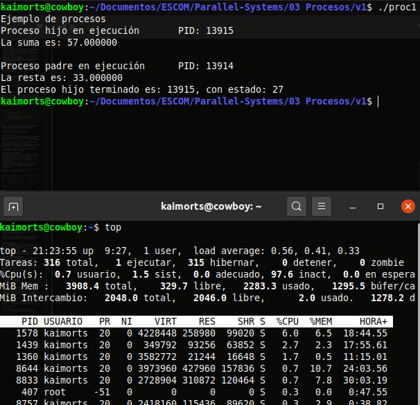

# Generación de procesos: Proceso hijo y padre

## Descripción
### Procesos

- La vida del __proceso__ inicia con la llamada al sistema `fork()`.
- El proceso que llama a `fork()` es el __padre__, mientras que el proceso nuevo es el __hijo__.
- El padre reanuda la ejecución y el hijo inicia la ejecución en el mismo lugar donde devuelve la llamada a `fork()`.
- El proceso termina y libera sus recursos con la llamada al sistema `exit()`.
- El proceso puede __preguntar sobre el estado de un proceso hijo terminado__ con al llamada al sistema `wait()`.
- Cuando un proceso termina __se coloca en un estado zombie__ que representa el proceso terminado hasta que el padre llama a `wait()`.

Para tener más detalles de llamada al sistema `fork()`, se puede ejecutar el comando `man fork` en una terminal.

```bash
NAME
       fork - create a child process

SYNOPSIS
       #include <sys/types.h>
       #include <unistd.h>

       pid_t fork(void);
....
....
```

## Descripción general de `proc1.c`

Cuando realizamos la llamada al sistema `fork()` se retorna un tipo de dato `pid_t`, el cuál nos permite obtener su identificador o __`PID` del proceso hijo creado__.

Una vez que se ha realizado esta llamada al sistema se debe de __verificar que el proceso fue creado correctamente__. Para poder hacer esto comprobamos el valor del `pid`.

```c 
int main(){

	pid_t pid = fork()
	
	if (pid == -1) {
		perror("Error al crear el proceso\n");
		exit(EXIT_FAILURE);
	}
	...
}
```
En este punto hay de dos sopas, o el PID es el del proceso hijo o del padre: ¿Cómo comprobamos eso? Bueno, realizando otra comparación más.

- Si `PID` = 0: Es un proceso hijo
- Si `PID` != 0: Es un proceso padre.

### Proceso hijo
- En el bloque de código perteneciente al proceso hijo, primero se obtiene el `PID` relacionado. Para hacer esto hacemos uso de la función `getpid()`.
- Posteriormente se realiza la tarea asignada a ese proceso, en este caso la suma.
- Finalmente, terminamos y liberamos loss recursos del proceso con la llamada al sistema `exit()`.

> Si usamos `exit(1)`, el valor que se retorna, si se imprime, será 256, ¿Porqué?

#### Explicando `exit(1)`
El objetivo de esta función es mandar el estado del proceso hijo para que padre sepa qué proceso hijo se está ejecutando. Este estado es determinado gracias a la función `exit()` que se usa dentro de cada bloque en la función `proceso_hijo`.
Es importante mencionar que al momento de retornar el valor la función `exit()`, este valor se regresa __con un corrimiento de 8 bits a la izquierda__. 

Es decir, si nosotros hacemos lo siguiente: `exit(1)`, la salida será __256__.


|--------| 2^10 | 2^9 | 2^8 | 2^7 | 2^6 | 2^5 | 2^4 | 2^3 | 2^2 | 2^1 | 2^0|
|--------|------|---------|---------|---------|---------|---------|---------|---------|---------|---------|--------|
|        | 1024 | 512     | 256     | 128     | 64      |    32   |    16   |    8    |    4    |    2    |    1   |
|exit(1) |      |         |         |         |         |         |         |         |         |         |    1   |
|output  |      |         |  1      | 0       | 0       |    0    |    0    |    0    |    0    |    0    |    0   |


Si nosotros hacemos ahora `exit(2)`, ¿qué valor sería? Nos daría como salida el __512__.


|--------| 2^10 | 2^9 | 2^8 | 2^7 | 2^6 | 2^5 | 2^4 | 2^3 | 2^2 | 2^1 | 2^0|
|--------|------|---------|---------|---------|---------|---------|---------|---------|---------|---------|--------|
|        | 1024 | 512     | 256     | 128     | 64      |    32   |    16   |    8    |    4    |    2    |    1   |
|exit(2) |      |         |         |         |         |         |         |         |         |    2    |        |
|output  |      |    1    |  0      | 0       | 0       |    0    |    0    |    0    |    0    |    0    |    0   |


Siempre serán 8 bits recorridos a la izquierda. Por tanto, para recuperar el valor original lo que se debe hacer es recorrer el valor de retorno 8 bits hacia la derecha. En este caso, la variable `estado` contiene el valor de retorno de `exit()`, y es a esta variable a la que se le hace el corrimiento: `(estado>>8)`.

Para este caso, la última línea del bloque del proceso hijo es `exit(27)`, en donde ese número 27 será el estado que recibirá el proceso padre.


### Proceso padre
- De forma análoga, se obtiene el `PID` del proceso padre y se muestra en pantalla haciendo uso de la función `getpid()`.
- La tarea asignada para el proceso padre es la resta de ambos números.
- Una vez que se realizar esta tarea lo que hacemos es __esperar al proceso hijo__. Para ello hacemos uso de la llamada al sistema __`wait()`__

#### Explicando `wait(estado)`
- Una vez que en el proceso hijo se realiza la llamada al sistema `exit(27)`, ese __número 27 >>representa<< el estado del proceso hijo__.
- Cuando termina y en el bloque del proceso padre se ejecuta la llamada al sistema `wait(&estado)`, dado que se pasa por referencia la variable __estado__, éste hace referencia al 27. Es decir, el proceso padre espera a que el hijo termine su tarea y regresa el pid del procesos hijo.
- Sin embargo, este valor __27__ tiene un corrimiento de 8 bits a la izquierda, por lo que debemos de hacer un corrimiento de 8 bits a la derecha para obtener el valor original.

```c
	...
	pid = wait(&estado);
	printf("El proceso hijo terminado es: %d, con estado: %d\n", pid, (estado>>8));
```

### Forzando un estado zombie
- Para porzar un estado zombie, basta con hacer una espera de 10 segundos, usando la función `sleep()`. Luego se abre una nueva terminal y vemos qué procesos se están ejecutando usando el comando `top`. Allí visualizaremos los procesos *zombies*.
- Es como los niños cuando esperan a sus papás en la escuela, puede pasar que al papá se le olvidó que ir por el hijo, jaja. Entonces el hijo entra en estado zombie, o sea, se saca de pedo.


## Ejecución de `proc1.c`

- Para poder ejecutar el programa es suficiente con abrir la terminal en la ruta donde se encuentra el archivo y ejecutar el comando: `make`.



- Una vez compilados todos los archivos necesarios, ejecutamos el programa. Pero antes, vamos a abrir otra terminal para poder visualizar aquellos procesos *zombies* que hemos forzado. Para esto ejecutamos el comando `top` en la nueva terminal, tal y como se muestra.



- Cuando se ejecuta el programa, vemos que aparece un proceso en estado *zombie*. ¡LO HEMOS LOGRADO!



- Cuando finalmente el programa termina, ya no hay más procesos zombies.



