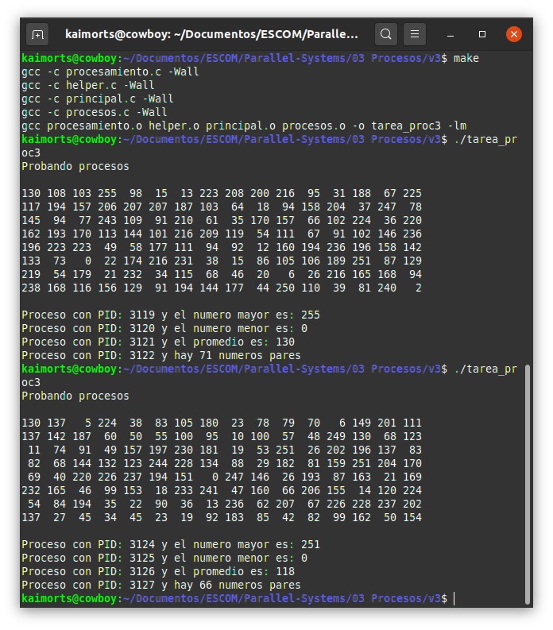

# Generación de procesos v3: Tarea

## Descripción.
Este programa genera **`N`** elementos aleatorios y los guarda en un arreglo **`datos`**. Las tareas principales son crear cuatro procesos distintos para:
1. Buscar el mayor del conjunto de valores
2. Buscar el menor del conjunto de valores
3. Calcular el promedio del conjunto de valores, sólo la parte entera.
4. Obtener cuántos números pares exiten en el conjunto de datos

## Estructura del código
En un principio se utiliza la misma estructura que el archivo contenido en `v2/proc2.c`. Sin embargo, el proyecto debe de crear módulos para cada una las tareas. El proyecto tiene la siguiente estructura:
- `principal.c`: Este archivo debe de tener a la función `main`.
- `procesos.c`: Este archivo debe tener las funciones del proceso hijo y el proceso padre.
- `procesamiento.c`: Este archivo debe de tener las funciones de los algoritmos.
- `helper.c`: Este archivo debe de tener las funciones de: `reservarMemoria`, `llenarArreglo` e `imprimirArreglo`.
- Definir los archivos `.h` correspondientes: `procesos.h`, `procesamiento.h`, `helper.h` y `defs.h` (contiene N y NUM_PROC).
- Archivo Makefile completo

FOTO DE LA ESTRUCTURA

* `función main()`: Contiene la lógica de ejecución del programa principal.
* `función proceso_padre()`: Da una descripción de cada hijo, mostrando su `estado` y `PID` asociado. 
* `función proceso_hijo(np, datos)`: Dependiendo del número de proceso (**`np`**) que sea, llama a la función para encontrar el __mayor o menor número__ en el arreglo **`datos`**.
	* `np = 0`: Llama a la función `encontrarMayor(datos)`.
	* `np = 1`: Llama a la función `encontrarMenor(datos)`.
	* `np = 2`: Llama a la función `calcularPromedio(datos)`.
	* `np = 3`: Llama a la función `contarPares(datos)`.
* Función`reservarMemoria()`: Reserva memoria para el arreglo de enteros llamado _`datos`_.
* Función`llenarArreglo(datos)`: Genera números entre 0 y 256 para los almacenarlos en el arreglo antes creado __`datos`__.
* Función `imprimirArreglo(datos)`: Imprime los valores del arreglo __`datos`__ por filas (cada 16 elementos).
* Función `encontrarMayor(datos)`: 	Encuentra el valor máximo en el arreglo __`datos`__.
* Función `encontrarMenor(datos)`: Encuentra el valor mínimo en el arreglo __`datos`__.
* Función `calcularPromedio(datos)`: Calcula el promedio del arreglo __`datos`__. 
* Función `cuantosPares(datos)`: Cuenta cuántos números pares están en el arreglo __`datos`__.

### Ejecutar programa
Para poder ejecutar este programa es suficiente con ejecutar el comando __`make`__ en una terminal en la ruta donde tienes guardado el archivo __`principal.c`__.

```
user@computer:~/path $ make
gcc -c proc2.c -Wall
gcc proc2.o -o proc2 -lm
```




